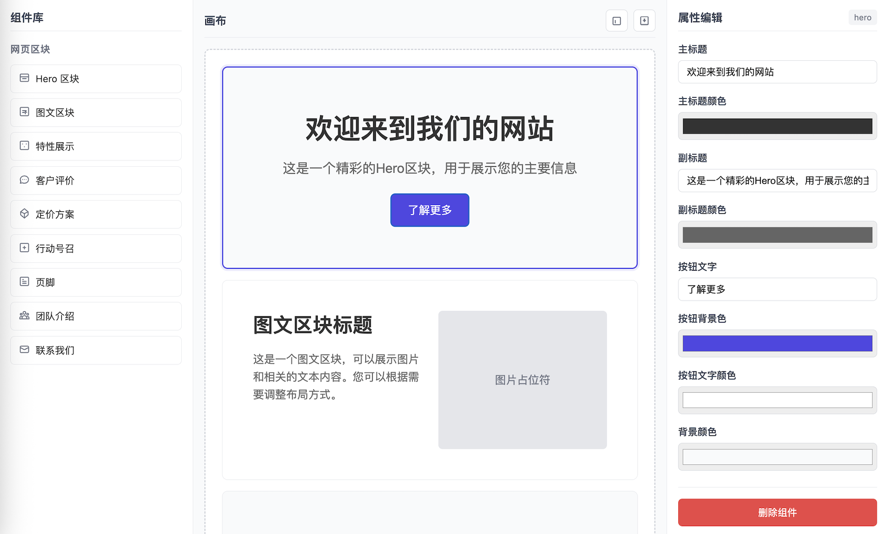

# BlockCanvas - 积木画布

[](https://vuejs.org/)
[](https://developer.mozilla.org/en-US/docs/Web/JavaScript)
[](LICENSE)

一个基于 Vue 3 的可视化拖拽组件编辑器，让界面构建像搭积木一样简单直观。



## 功能特性

- 🖱️ 直观的拖拽式界面构建
- 🎨 实时属性编辑与预览
- 💾 自动本地存储，数据不丢失
- 📤 一键导出配置为JSON文件
- 🧩 可扩展的组件系统

## 技术栈

- **前端框架**: Vue 3 (Composition API)
- **拖拽库**: vuedraggable
- **样式**: 纯CSS (Flexbox/Grid布局)
- **构建工具**: Vite (推荐)

## 安装与使用

### 环境要求

- Node.js 14.0+
- npm 或 yarn

### 安装步骤

1. 克隆项目
```bash
git clone https://github.com/wumacms/block-canvas.git
cd block-canvas
```

2. 安装依赖
```bash
pnpm install
```

3. 启动开发服务器
```bash
pnpm run dev
```

4. 构建生产版本
```bash
pnpm run build
```

## 使用指南

### 添加组件
1. 从左側组件库拖动所需组件到画布
2. 组件将自动添加到画布中

### 编辑属性
1. 点击画布中的组件选中它
2. 在右侧属性面板中修改属性
3. 更改将实时反映在画布中

### 导出配置
1. 点击画布右上角的导出按钮
2. 系统将生成并下载JSON配置文件

### 清空画布
1. 点击画布右上角的清空按钮
2. 确认后所有组件将被移除

## 许可证

本项目采用 MIT 许可证 - 查看 [LICENSE](LICENSE) 文件了解详情

## 致谢

- [Vue.js](https://vuejs.org/) - 渐进式JavaScript框架
- [vuedraggable](https://github.com/SortableJS/vuedraggable) - Vue拖拽组件
- [Vite](https://vitejs.dev/) - 下一代前端构建工具

## 联系方式

- 邮箱: wumacms@foxmail.com
- GitHub: [@wumacms](https://github.com/wumacms)

---

⭐ 如果这个项目对你有帮助，请给它一个星标！